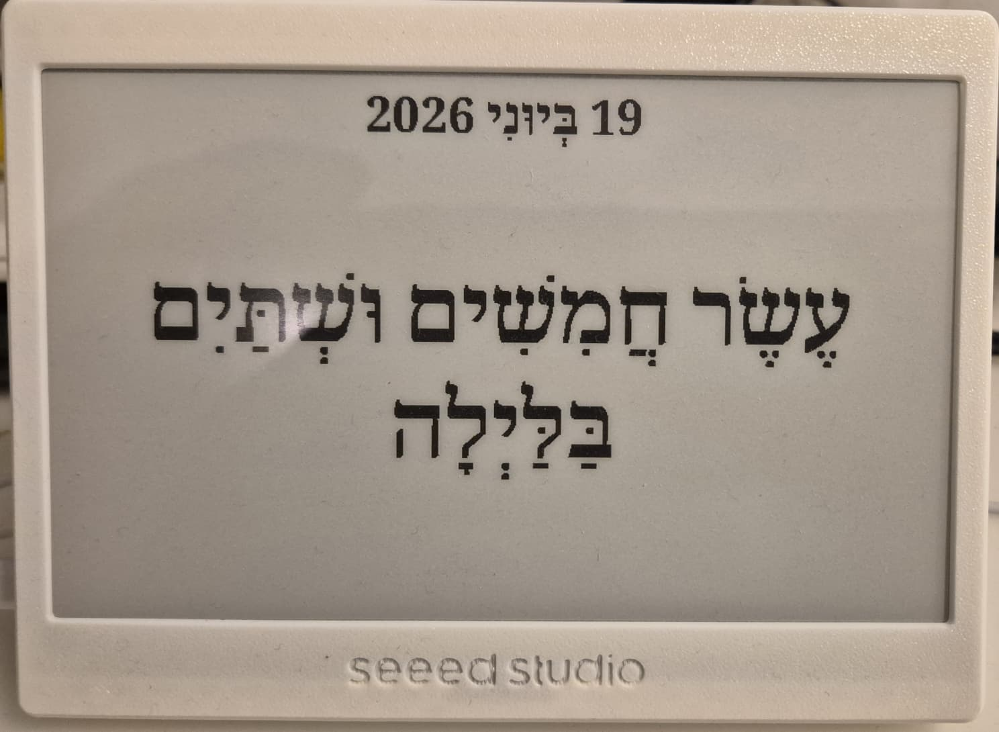
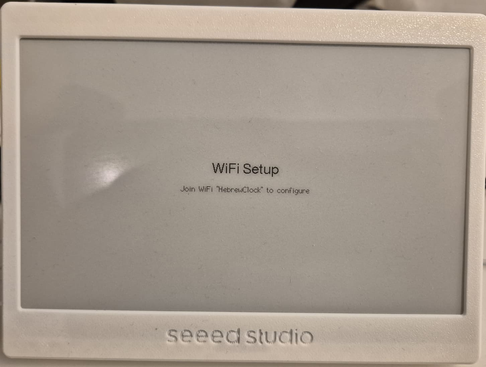
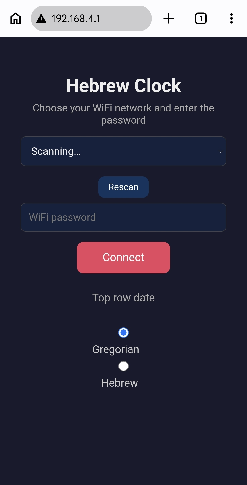
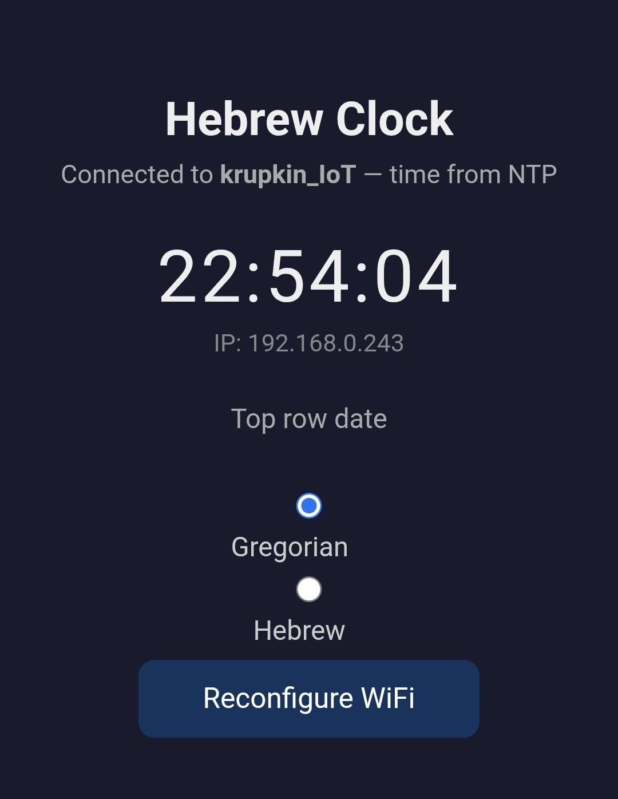

# Hebrew Clock (NTP)

A Hebrew **word clock** for a 7.5″ e-paper display. Instead of digits, it spells
out the current time in fully-vocalized Hebrew (with niqud) — e.g.
*שָׁלוֹשׁ וָרֶבַע בַּצָּהֳרַיִם* ("a quarter past three in the afternoon") — and shows
the date (Gregorian or Hebrew) on the top row.

Time comes from the internet over **NTP**, so the clock is always accurate and
never needs setting. WiFi is configured entirely on-device through a captive
setup portal — no credentials are hardcoded.

---

## Screenshots

### The clock

The time spelled out in vocalized Hebrew, with the date on the top row.



### First-boot WiFi setup

When no credentials are stored, the e-paper prompts you to join the device's
own setup access point.



### Captive setup portal

Join the `HebrewClock` network and the portal at `192.168.4.1` lets you pick
your WiFi, enter the password, and choose the top-row date mode.



### Status page

Once connected, the device serves a status page with the live time, its IP, the
date-mode toggle, and a "Reconfigure WiFi" button.



---

## Features

- **Time spelled out in Hebrew words** with full niqud (vowel marks), laid out
  right-to-left across up to three centred lines.
  - Hours, minutes, quarter (`וָרֶבַע`) / half (`וָחֵצִי`) past, and
    "minutes-to" forms for `:40 / :45 / :50 / :55` (e.g. *רֶבַע לְאַרְבַּע* —
    "quarter to four").
  - A time-of-day period word — בַּבֹּקֶר / בַּצָּהֳרַיִם / בָּעֶרֶב / בַּלַּיְלָה /
    לִפְנוֹת בֹּקֶר — chosen from the 24-hour hour.
- **Date on the top row**, switchable at runtime between:
  - **Gregorian** — day + Hebrew month name + year (e.g. *14 בְּיוּנִי 2026*).
  - **Hebrew (Jewish) date** — e.g. *ג׳ בְּתַמּוּז תשפ״ו*, from a built-in
    converter table covering **2026-06-01 … 2031-01-01**. Dates outside that
    range fall back to the Gregorian display.
- **NTP time sync** with Israel timezone and automatic DST
  (`IST-2IDT,M3.4.4/26,M10.5.0`). SNTP keeps the soft-clock in sync in the
  background; the display redraws on each minute change.
- **On-device WiFi setup** via a captive portal — scan for networks, pick one,
  enter the password. Credentials are stored in NVS and reused on every boot.
  "Reconfigure WiFi" clears them and reopens the portal.
- **Built-in status web page** (once connected) showing the live time, the
  device IP, the date-mode toggle, and the reconfigure button.
- **e-paper-friendly rendering**: full refresh on boot and on date change,
  partial (differential) refresh every minute, with a periodic full refresh to
  clear ghosting. No deep sleep — the device stays reachable on the network.
- **Custom RTL + niqud text engine**: glyphs are drawn individually so combining
  vowel marks (which Adafruit-GFX fonts can't position) land correctly on their
  base letters; digits inside RTL text stay left-to-right.

---

## Hardware

| Part | Notes |
|---|---|
| **Seeed Studio XIAO ESP32** (C3 / S3) | The MCU. Provides WiFi for NTP and the setup/status web server. |
| **Seeed Studio XIAO 7.5″ e-Paper driver board** | Board/screen combo **model 502** (`UC8179` controller, 800×480). |
| **7.5″ e-paper panel (800×480)** | The display itself. |

The board/screen selection is pinned in [`NTPClock/driver.h`](NTPClock/driver.h):

```c
#define BOARD_SCREEN_COMBO 502
#define USE_XIAO_EPAPER_DRIVER_BOARD
```

---

## Repository layout

```
NTPClock/
  NTPClock.ino                 # main sketch (WiFi, web server, e-paper drawing)
  driver.h                     # board / screen combo selection
  time_words.h                 # Hebrew time-as-words tables (hours, minutes, periods)
  hebrew_date.h                # Gregorian → Hebrew date lookup table (2026–2031)
  hebrew_date.h / hebrew24*.h  # supporting date/font data
  NotoSerifHebrew_Bold_85.h    # 85px Hebrew GFX font with niqud
  secrets.h                    # (no longer used — WiFi is set via the portal)
libraries/                     # vendored Arduino libraries (see below)
```

---

## Dependencies

The Arduino libraries are vendored under [`libraries/`](libraries/):

- **Seeed_GFX** — the display driver (`TFT_eSPI`-compatible `EPaper` class for
  the XIAO e-paper board).
- **Adafruit GFX** + **Adafruit BusIO** — font/graphics primitives.
- **GxEPD2**, **U8g2_for_Adafruit_GFX**, **ArduinoJson**, **RTC / RTClib** —
  supporting libraries.

You also need the **ESP32 Arduino core** (provides `WiFi`, `WebServer`,
`DNSServer`, `Preferences`, and SNTP `configTime`).

---

## Building & flashing

1. **Install the ESP32 Arduino core** in the Arduino IDE
   (Boards Manager → "esp32" by Espressif).
2. **Select your board**: the matching *Seeed XIAO ESP32* variant.
3. **Make the vendored libraries available** — either copy the folders from
   [`libraries/`](libraries/) into your Arduino `libraries` directory, or point
   your sketchbook at this repo so they resolve.
4. **Enable partial refresh** (required — the sketch calls
   `epaper.updataPartial()`). Add this line to the Seeed_GFX user setup for the
   board (e.g. `User_Setups/Setup502_Seeed_XIAO_EPaper_7inch5.h`):

   ```c
   #define USE_PARTIAL_EPAPER
   ```

   Without it the partial-refresh call won't compile.
5. **Open** [`NTPClock/NTPClock.ino`](NTPClock/NTPClock.ino), compile, and
   upload. Serial monitor runs at **115200** baud.

> `secrets.h` is intentionally empty — there is nothing to fill in. WiFi is
> configured on the device.

---

## First-time setup (WiFi)

On first boot (or after "Reconfigure WiFi") the device has no stored
credentials and opens its own setup access point:

1. The e-paper shows **"Join WiFi 'HebrewClock' to configure"**.
2. On your phone/laptop, join the **`HebrewClock`** WiFi network (open, no
   password). A captive portal opens automatically; if not, browse to
   **http://192.168.4.1**.
3. Pick your WiFi network from the list (tap **Rescan** if needed), enter the
   password, choose **Gregorian** or **Hebrew** for the top-row date, and tap
   **Connect**.
4. The device saves the credentials to NVS, restarts, joins your network, and
   pulls the time from NTP. From then on it reconnects automatically on every
   boot.

---

## Daily use & status page

Once connected, the device runs a small status server. Browse to the device's
IP (printed on the e-paper and to serial) to:

- See the **live time** (`HH:MM:SS`) and the device **IP**.
- Switch the top-row date between **Gregorian** and **Hebrew** — the e-paper
  redraws on the next update.
- **Reconfigure WiFi** — clears stored credentials and restarts back into the
  setup portal.

The date-mode choice is persisted in NVS and survives reboots.

---

## How the time wording works

The phrase is assembled in `splitTimePhrase()` using the tables in
[`time_words.h`](NTPClock/time_words.h):

| Minute | Form | Example (3 o'clock) |
|---|---|---|
| `:00` | hour only | *שָׁלוֹשׁ בַּצָּהֳרַיִם* |
| `:15` | hour + `וָרֶבַע` | *שָׁלוֹשׁ וָרֶבַע …* |
| `:30` | hour + `וָחֵצִי` | *שָׁלוֹשׁ וָחֵצִי …* |
| `:40 / :45 / :50 / :55` | "minutes-to" + next hour with `ל־` prefix | *רֶבַע לְאַרְבַּע …* |
| any other | hour + minute fragment | *שָׁלוֹשׁ וְעֶשֶׂר דַקּוֹת …* |

Longer phrases wrap onto a second (and the period word onto a third) line, all
centred and vertically balanced inside the time box.

---

## Configuration reference

Most settings are `#define`s near the top of
[`NTPClock.ino`](NTPClock/NTPClock.ino):

| Setting | Default | Purpose |
|---|---|---|
| `AP_SSID` | `"HebrewClock"` | Setup access-point name. |
| `AP_PASSWORD` | `""` (open) | Setup AP password. |
| `timeZone` | `IST-2IDT,M3.4.4/26,M10.5.0` | POSIX TZ (Israel, with DST). |
| `NTP_SERVER1/2` | `pool.ntp.org`, `time.google.com` | NTP sources. |
| `WIFI_CONNECT_TIMEOUT_MS` | `20000` | Give up joining WiFi after this. |
| `NTP_SYNC_TIMEOUT_MS` | `15000` | Give up the first NTP wait after this. |
| `FULL_REFRESH_EVERY` | `15` | Partial refreshes between forced full refreshes. |

To run in a different timezone, change `timeZone` to the appropriate POSIX TZ
string. (Note: the Hebrew-date table and month names are oriented around the
built-in range; see `hebrew_date.h` to extend it.)

---

## Notes

- `NTPClock/TIMEZONE_BUG.md` documents an earlier deep-sleep timezone issue. The
  current sketch does **not** deep sleep — it stays connected and applies the TZ
  on every boot — so that class of bug no longer applies.
- The Hebrew font ends at `U+05EA`, so it has no glyphs for the Hebrew numeral
  punctuation geresh/gershayim (`׳`/`״`); the date renderer swaps them for the
  ASCII `'`/`"`, which read identically.

---

## License

Apache License 2.0 — see [LICENSE](LICENSE).
