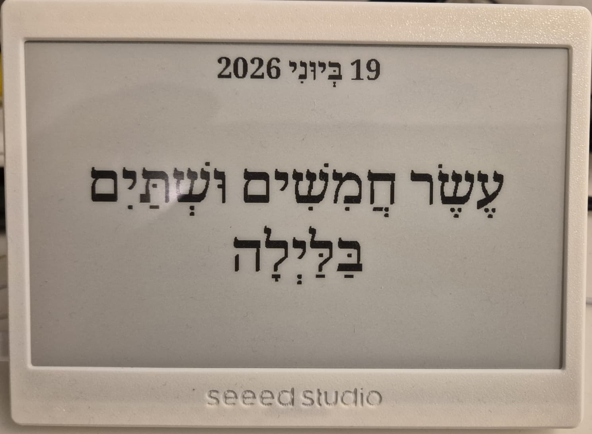
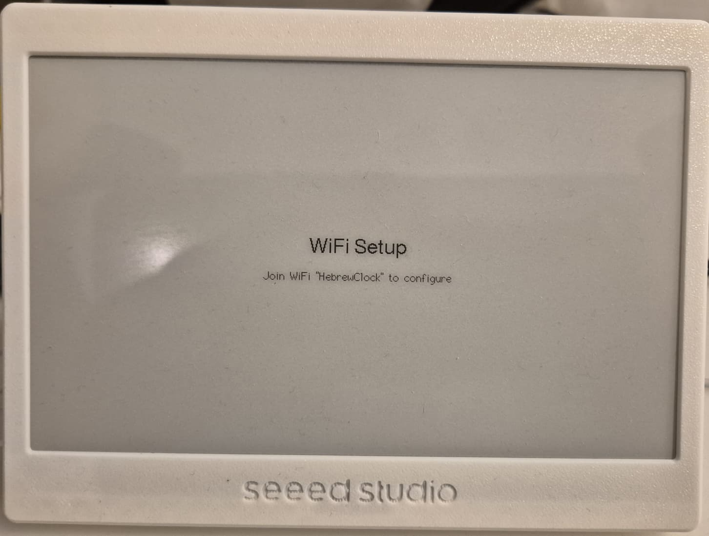
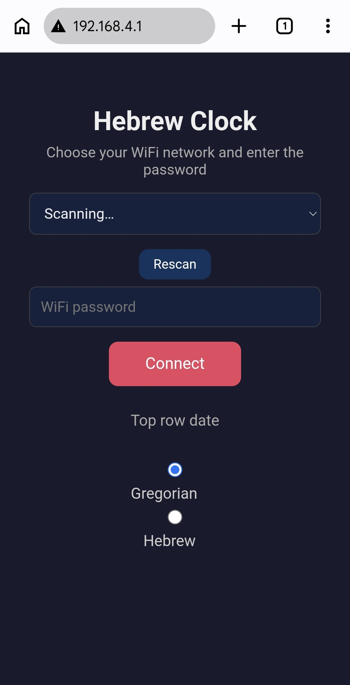
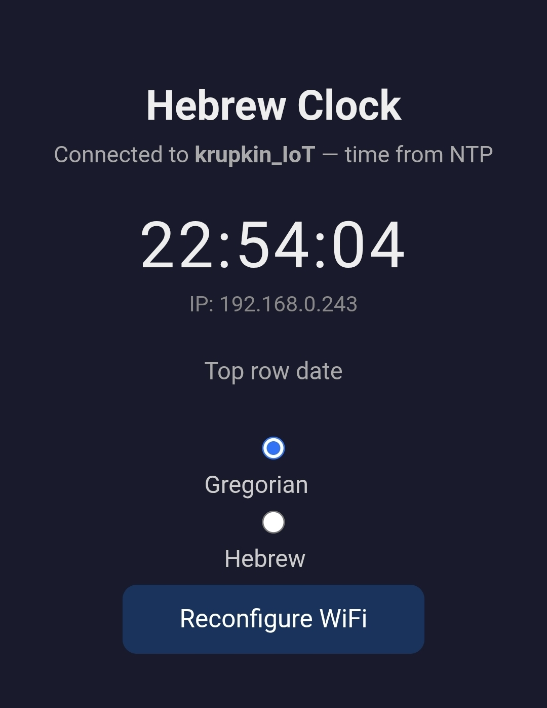
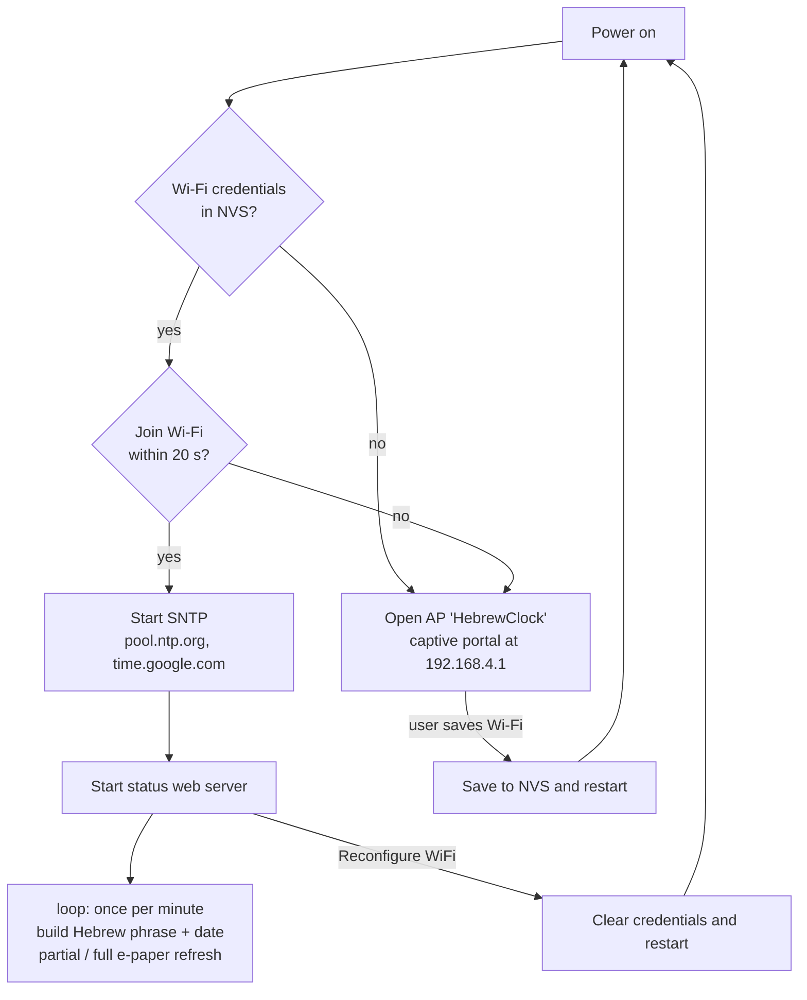

# Hebrew Clock (NTP)

A Hebrew **word clock** for a 7.5″ e-paper display, running as standalone
firmware on a Seeed Studio XIAO ESP32. Instead of digits, it spells out the
current time in fully vocalized Hebrew (with niqud), e.g.
*שָׁלוֹשׁ וָרֶבַע בַּצָּהֳרַיִם* ("a quarter past three in the afternoon"), and shows
the date (Gregorian or Hebrew) on the top row.

Time comes from the internet over **NTP**, so the clock stays accurate and
never needs setting. Wi-Fi is configured entirely on the device through a
captive setup portal, so no credentials are hardcoded. No server and no RTC
module are needed: the ESP32 renders everything itself.

---

## Contents

- [Screenshots](#screenshots)
- [Features](#features)
- [How it works](#how-it-works)
- [Hardware](#hardware)
- [Repository layout](#repository-layout)
- [Dependencies](#dependencies)
- [Installation](#installation)
- [First-time setup (Wi-Fi)](#first-time-setup-wi-fi)
- [Daily use & status page](#daily-use--status-page)
- [How the time wording works](#how-the-time-wording-works)
- [Configuration reference](#configuration-reference)
- [Security notes](#security-notes)
- [Troubleshooting](#troubleshooting)
- [Known issues & notes](#known-issues--notes)
- [Related projects](#related-projects)
- [Contributing](#contributing)
- [Credits](#credits)
- [License](#license)

---

## Screenshots

### The clock

The time spelled out in vocalized Hebrew, with the date on the top row.



### First-boot Wi-Fi setup

When no credentials are stored, the e-paper prompts you to join the device's
own setup access point.



### Captive setup portal

Join the `HebrewClock` network, and the portal at `192.168.4.1` lets you pick
your Wi-Fi network, enter the password, and choose the top-row date mode.



### Status page

Once connected, the device serves a status page with the live time, its IP, the
date-mode toggle, and a "Reconfigure WiFi" button.



---

## Features

- **Time spelled out in Hebrew words** with full niqud (vowel marks), laid out
  right-to-left across up to three centered lines.
  - Hours, minutes, quarter (`וָרֶבַע`) / half (`וָחֵצִי`) past, and
    "minutes-to" forms for `:40 / :45 / :50 / :55` (e.g. *רֶבַע לְאַרְבַּע*,
    "quarter to four").
  - A time-of-day period word, chosen from the 24-hour hour:

    | Hours | Word |
    |---|---|
    | 06:00–11:59 | בַּבֹּקֶר |
    | 12:00–17:59 | בַּצָּהֳרַיִם |
    | 18:00–19:59 | בָּעֶרֶב |
    | 20:00–03:59 | בַּלַּיְלָה |
    | 04:00–05:59 | לִפְנוֹת בֹּקֶר |

- **Date on the top row**, switchable at runtime between:
  - **Gregorian**: day + Hebrew month name + year (e.g. *14 בְּיוּנִי 2026*).
  - **Hebrew (Jewish) date**: e.g. *ג׳ בְּתַמּוּז תשפ״ו*, from a built-in
    lookup table (generated from the hebcal.com converter) covering
    **2026-06-01 … 2031-01-01**. Dates outside that range fall back to the
    Gregorian display.
- **NTP time sync** with the Israel timezone and automatic DST
  (`IST-2IDT,M3.4.4/26,M10.5.0`). SNTP keeps the soft clock in sync in the
  background; the display redraws on each minute change.
- **On-device Wi-Fi setup** via a captive portal: scan for networks, pick one,
  enter the password. Credentials are stored in NVS and reused on every boot.
  "Reconfigure WiFi" clears them and reopens the portal.
- **Built-in status web page** (once connected) showing the live time, the
  connected network, the device IP, the date-mode toggle, and the reconfigure
  button.
- **E-paper-friendly rendering**: full refresh on boot and on date change,
  partial (differential) refresh of the time area every minute (skipped when the
  text didn't change), with a forced full refresh every 15 partial updates to
  clear ghosting. No deep sleep: the device stays reachable on the network.
- **Custom RTL + niqud text engine**: glyphs are drawn individually so combining
  vowel marks (which Adafruit-GFX-style fonts can't position) land correctly on
  their base letters; digits inside RTL text stay left-to-right. The single 85 px
  font is downscaled on the fly for the time (≈80 px) and the date row (≈42 px).

---

## How it works


```mermaid
flowchart TD
    A[Power on] --> B{Wi-Fi credentials<br/>in NVS?}
    B -- no --> P[Open AP 'HebrewClock'<br/>captive portal at 192.168.4.1]
    B -- yes --> C{Join Wi-Fi<br/>within 20 s?}
    C -- no --> P
    C -- yes --> N[Start SNTP<br/>pool.ntp.org, time.google.com]
    N --> S[Start status web server]
    S --> L[loop: once per minute<br/>build Hebrew phrase + date<br/>partial / full e-paper refresh]
    P -- user saves Wi-Fi --> R[Save to NVS and restart]
    R --> A
    S -- Reconfigure WiFi --> F[Clear credentials and restart]
    F --> A
```

The system clock is kept in UTC (`configTime(0, 0, …)`), and the POSIX `TZ`
string converts it to local time for display. If the first NTP sync doesn't
arrive within 15 seconds, the e-paper shows "Waiting for time sync..." and
`loop()` keeps polling until the time is valid.

---

## Hardware

| Part | Notes |
|---|---|
| **Seeed Studio XIAO ESP32** (C3 / S3) | The MCU. Provides Wi-Fi for NTP and the setup/status web server. |
| **Seeed Studio XIAO 7.5″ ePaper driver board** | Board/screen combo **502** in Seeed_GFX (`UC8179` controller, 800×480). The XIAO plugs into this board. |
| **7.5″ e-paper panel (800×480)** | The display itself, connected to the driver board's FPC connector. |

The board/screen selection is pinned in [`NTPClock/driver.h`](NTPClock/driver.h):

```c
#define BOARD_SCREEN_COMBO 502
#define USE_XIAO_EPAPER_DRIVER_BOARD
```

### Pins

There is no manual wiring: the XIAO sits on the driver board. For reference,
the SPI pins come from the `USE_XIAO_EPAPER_DRIVER_BOARD` block of
[`EPaper_Board_Pins_Setups.h`](libraries/Seeed_GFX/User_Setups/EPaper_Board_Pins_Setups.h)
in Seeed_GFX (`Dynamic_Setup.h` enables `ENABLE_EPAPER_BOARD_PIN_SETUPS`):

| Signal | XIAO pin |
|---|---|
| SCLK | D8 |
| MISO | D9 |
| MOSI | D10 |
| CS | D1 |
| DC | D3 |
| BUSY | D2 |
| RST | D0 |

---

## Repository layout

```
NTPClock/
  NTPClock.ino                 # main sketch (Wi-Fi, web server, e-paper drawing)
  driver.h                     # board / screen combo selection
  time_words.h                 # Hebrew time-as-words tables (hours, minutes, periods)
  hebrew_date.h                # Gregorian → Hebrew date lookup table (2026–2031)
  hebrew24.h / hebrew24_ram.h  # older font data, not included by the sketch
  NotoSerifHebrew_Bold_85.h    # older, lighter render of the font; not used (the sketch includes the Seeed_GFX one)
  secrets.h                    # no longer used (Wi-Fi is set via the portal)
  TIMEZONE_BUG.md              # notes on an earlier deep-sleep timezone bug
libraries/                     # vendored Arduino libraries (see below)
assets/screenshots/            # README images
```

---

## Dependencies

The Arduino libraries are vendored under [`libraries/`](libraries/):

| Library | Version | Used by the sketch |
|---|---|---|
| **Seeed_GFX** | 2.0.3 | **Yes.** Display driver (`TFT_eSPI`-compatible `EPaper` class). This copy is pre-configured for this project (see below). |
| Adafruit GFX Library | 1.12.5 | No |
| Adafruit BusIO | 1.17.4 | No |
| GxEPD2 | 1.6.8 | No |
| U8g2_for_Adafruit_GFX | 1.8.0 | No |
| ArduinoJson | 7.4.3 | No |
| RTC | 1.12.0 | No |
| RTClib | 2.1.4 | No |

Only Seeed_GFX is included by `NTPClock.ino`; the others are vendored alongside
it but not needed to build this sketch.

The vendored Seeed_GFX differs from upstream in three ways that the sketch
relies on:

- `User_Setup_Select.h` defaults to board/screen combo **502**, so the
  library's own source files are compiled for the same board as the sketch
  (otherwise the link fails with `undefined reference to EPaper::...`).
- `User_Setups/Setup502_Seeed_XIAO_EPaper_7inch5.h` already defines
  `USE_PARTIAL_EPAPER`, which enables `epaper.updataPartial()`.
- `Fonts/Custom/NotoSerifHebrew_Bold_85.h` contains the Hebrew font with niqud
  that the sketch includes.

You also need the **ESP32 Arduino core** (provides `WiFi`, `WebServer`,
`DNSServer`, `Preferences`, and SNTP `configTime`).

---

## Installation

### Option A: flash a prebuilt image from the browser

The self-hosted [heb-clock-flasher](https://github.com/t0mer/heb-clock-flasher)
catalogue includes this firmware as **Hebrew Clock (NTP)** (version `2026.6.0`,
built for **ESP32-C3**). However, the flasher repository ships only the
product and manifest metadata for this entry: the firmware `.bin` files are
gitignored there, and this repository publishes no GitHub releases. A
self-hosted flasher therefore has no binary to flash unless its operator builds
the firmware (Option B) and adds the images to the catalogue. Once they are in
place, open the flasher in Chrome or Edge, pick the product, connect the XIAO
over USB, and click **Connect & flash**. For an XIAO ESP32-S3, build from
source (Option B).

### Option B: build and flash with the Arduino IDE

1. **Install the ESP32 Arduino core** in the Arduino IDE
   (Boards Manager → "esp32" by Espressif).
   <!-- TODO: verify the ESP32 core version this sketch was built and tested with -->
2. **Select your board**: *XIAO_ESP32C3* or *XIAO_ESP32S3*, matching your XIAO.
3. **Make the vendored libraries available**. Either set the Arduino IDE
   sketchbook location to this repository's root
   (*File → Preferences → Sketchbook location*), so that
   [`libraries/`](libraries/) is picked up and `NTPClock` shows up under
   *File → Sketchbook*, or copy
   [`libraries/Seeed_GFX`](libraries/Seeed_GFX) into your own Arduino
   `libraries` directory.
4. **Use the vendored Seeed_GFX if you can.** It already has everything the
   sketch needs. If you use a stock Seeed_GFX instead, make three changes:
   - In `User_Setup_Select.h`, default the board to combo 502 before
     `driver.h` is included (copy lines 3–14 of the vendored
     [`User_Setup_Select.h`](libraries/Seeed_GFX/User_Setup_Select.h)). The
     sketch's `driver.h` isn't visible when the library's own `.cpp` files are
     compiled, so without this the link fails with
     `undefined reference to EPaper::...`.
   - In `User_Setups/Setup502_Seeed_XIAO_EPaper_7inch5.h`, add
     `#define USE_PARTIAL_EPAPER`. Without it, the `epaper.updataPartial()`
     call won't compile ("updata" is the library's actual spelling).
   - Copy
     [`libraries/Seeed_GFX/Fonts/Custom/NotoSerifHebrew_Bold_85.h`](libraries/Seeed_GFX/Fonts/Custom/NotoSerifHebrew_Bold_85.h)
     into the library's `Fonts/Custom/` folder. (The file in `NTPClock/` is an
     older, lighter render and isn't the one the sketch expects.)
5. **Open** [`NTPClock/NTPClock.ino`](NTPClock/NTPClock.ino), compile, and
   upload. The serial monitor runs at **115200** baud.

> `secrets.h` is intentionally empty; there is nothing to fill in. Wi-Fi is
> configured on the device.

---

## First-time setup (Wi-Fi)

On first boot (or after "Reconfigure WiFi") the device has no stored
credentials and opens its own setup access point:

1. The e-paper shows **"Join WiFi "HebrewClock" to configure"**.
2. On your phone or laptop, join the **`HebrewClock`** Wi-Fi network (open, no
   password). A captive portal opens automatically; if it doesn't, browse to
   **http://192.168.4.1**.
3. Optionally choose **Gregorian** or **Hebrew** for the top-row date (the
   choice is saved immediately when you tap it). Then pick your Wi-Fi network
   from the list (tap **Rescan** if needed), enter the password, and tap
   **Connect**.
4. The device saves the credentials to NVS, restarts, joins your network, and
   pulls the time from NTP. From then on it reconnects automatically on every
   boot.

---

## Daily use & status page

Once connected, the device runs a small status server on port 80. Browse to the
device's IP (printed to the serial console at boot, or look it up in your
router's client list) to:

- See the **live time** (`HH:MM:SS`, refreshed every second), the connected
  network, and the device **IP**.
- Switch the top-row date between **Gregorian** and **Hebrew**. The e-paper
  redraws with a full refresh on the next loop.
- **Reconfigure WiFi**: clears the stored credentials and restarts into the
  setup portal.

The date-mode choice is persisted in NVS and survives reboots.

### HTTP endpoints

| Mode | Method | Path | Purpose |
|---|---|---|---|
| Portal + status | `GET` | `/` | Setup page (portal) or status page (connected). |
| Portal | `GET` | `/scan` | JSON list of visible networks: `[{"ssid":"…","rssi":-60,"enc":1}]`. |
| Portal | `POST` | `/connect` | Form fields `ssid`, `pass`; saves them and restarts. |
| Portal + status | `POST` | `/datemode` | Form field `mode` = `0` (Gregorian) or `1` (Hebrew). |
| Status | `GET` | `/time` | Current local time as plain text `HH:MM:SS` (`--:--:--` before sync). |
| Status | `POST` | `/forget` | Clears the Wi-Fi credentials and restarts into the portal. |

In portal mode, every other URL is redirected to `http://192.168.4.1/` (this
triggers the phone's "sign in to network" prompt). In status mode, unknown URLs
serve the status page.

Example:

```bash
curl http://<device-ip>/time
curl -X POST -d mode=1 http://<device-ip>/datemode   # show the Hebrew date
```

---

## How the time wording works

The phrase is assembled in `splitTimePhrase()` using the tables in
[`time_words.h`](NTPClock/time_words.h):

| Minute | Form | Example (3 o'clock) |
|---|---|---|
| `:00` | hour only | *שָׁלוֹשׁ בַּצָּהֳרַיִם* |
| `:15` | hour + `וָרֶבַע` | *שָׁלוֹשׁ וָרֶבַע …* |
| `:30` | hour + `וָחֵצִי` | *שָׁלוֹשׁ וָחֵצִי …* |
| `:40 / :45 / :50 / :55` | "minutes-to" + next hour with `ל־` prefix | *רֶבַע לְאַרְבַּע …* |
| any other | hour + minute fragment | *שָׁלוֹשׁ וְעֶשֶׂר דַקּוֹת …* |

Line breaks follow a fixed rule, not the phrase length. Most times use two
lines: the hour phrase on line 1 and the period word on line 2. Three lines
(hour / minute fragment / period) are used only at 11 and 12 o'clock and for
the three-word minute fragments (`:11`–`:14`, `:16`–`:19`). The lines are
centered and vertically balanced inside the time box.

---

## Configuration reference

Settings are constants near the top of
[`NTPClock.ino`](NTPClock/NTPClock.ino). Change them and re-flash:

| Setting | Default | Purpose |
|---|---|---|
| `AP_SSID` | `"HebrewClock"` | Setup access-point name. |
| `AP_PASSWORD` | `""` (open) | Setup AP password. |
| `RESET_SETTINGS` | commented out | Uncomment, flash once to wipe all stored settings (Wi-Fi credentials + date mode), then comment it out and re-flash. |
| `timeZone` | `IST-2IDT,M3.4.4/26,M10.5.0` | POSIX TZ (Israel, with DST). |
| `NTP_SERVER1` / `NTP_SERVER2` | `pool.ntp.org`, `time.google.com` | NTP sources. |
| `WIFI_CONNECT_TIMEOUT_MS` | `20000` | Give up joining Wi-Fi after this and open the portal. |
| `NTP_SYNC_TIMEOUT_MS` | `15000` | Give up the first blocking NTP wait after this (polling continues in `loop()`). |
| `FULL_REFRESH_EVERY` | `15` | Partial refreshes between forced full refreshes. |

Values stored at runtime in NVS (namespace `hebtime`): `ssid`, `pass`, and
`datemode` (`0` = Gregorian, `1` = Hebrew).

To run in a different timezone, change `timeZone` to the appropriate POSIX TZ
string. The Hebrew-date table covers only its built-in range; see
[`hebrew_date.h`](NTPClock/hebrew_date.h) to regenerate or extend it.

---

## Security notes

- The setup access point is **open by default** (`AP_PASSWORD` is empty). Set a
  password if you don't want nearby devices to reach the portal during setup.
- The Wi-Fi password is stored in NVS (ESP32 `Preferences`) in plain form.
- The status page has **no authentication**. Anyone on the same network can
  change the date mode or press "Reconfigure WiFi", which puts the clock back
  into its (open) setup portal. Keep the clock on a trusted network.
- The web server is plain HTTP; don't expose it to the internet.

---

## Troubleshooting

- **The clock shows the setup screen after a power cut.** If the stored
  network can't be joined within 20 seconds (for example, the router is still
  booting), the device falls back to the setup portal. Power-cycle it once the
  router is up; the stored credentials are kept.
- **"Waiting for time sync..." stays on screen.** The device joined Wi-Fi but
  hasn't received NTP time yet. It keeps retrying; check that outbound NTP
  (UDP 123) to `pool.ntp.org` / `time.google.com` is allowed.
- **My network isn't in the list.** The portal skips hidden (blank-SSID)
  networks, and the ESP32-C3/S3 only see 2.4 GHz networks. Tap **Rescan**.
- **`updataPartial` doesn't compile.** `USE_PARTIAL_EPAPER` isn't defined in
  the Seeed_GFX setup file you're building with; use the vendored library or
  see step 4 of [Installation](#option-b-build-and-flash-with-the-arduino-ide).
- **`undefined reference to EPaper::...` at link time.** The Seeed_GFX library
  being compiled isn't set to combo 502; use the vendored copy, whose
  `User_Setup_Select.h` handles this.
- **Wrong hour.** Check `timeZone`: POSIX offsets are inverted (`UTC-6` means
  UTC+6). See [`TIMEZONE_BUG.md`](NTPClock/TIMEZONE_BUG.md).
- **Start from scratch.** Use "Reconfigure WiFi" on the status page, or flash
  once with `RESET_SETTINGS` enabled.

---

## Known issues & notes

- [`NTPClock/TIMEZONE_BUG.md`](NTPClock/TIMEZONE_BUG.md) documents an earlier
  ESP32-C3 deep-sleep build in which the hour alternated between two values
  across wakes, plus a mis-set `UTC-6` timezone. The current sketch does **not**
  deep sleep: it stays connected and applies the TZ on every boot and after
  `configTime()`, so that class of bug no longer applies.
- The Hebrew font ends at `U+05EA`, so it has no glyphs for the Hebrew numeral
  punctuation geresh/gershayim (`׳`/`״`); the date renderer swaps them for the
  ASCII `'`/`"`, which read identically.
- The Hebrew date is a lookup table, not a calendar algorithm. After
  2031-01-01 the top row falls back to the Gregorian date until the table is
  regenerated.

---

## Related projects

- [hebrew-clock](https://github.com/t0mer/hebrew-clock): the server-based
  variant, where a FastAPI server renders the clock face (with weather and
  more) and the ESP32 displays it.
- [heb-clock-flasher](https://github.com/t0mer/heb-clock-flasher): a
  self-hosted, browser-based flasher for the Hebrew clock firmwares, including
  this one.

---

## Contributing

Issues and pull requests are welcome. Please test changes on real hardware
(the e-paper refresh behavior and niqud placement can't be checked in a
simulator) and include a serial log (115200 baud) when reporting a bug.

---

## Credits

- [Seeed_GFX](https://github.com/Seeed-Studio/Seeed_GFX) (based on Bodmer's
  TFT_eSPI): e-paper driver.
- [Noto Serif Hebrew](https://fonts.google.com/noto/specimen/Noto+Serif+Hebrew)
  (variable font at weight 700), converted to an 85 px GFX bitmap font.
- [Hebcal](https://www.hebcal.com/converter): source of the Hebrew-date table.
- Other vendored libraries: [Adafruit GFX](https://github.com/adafruit/Adafruit-GFX-Library),
  [Adafruit BusIO](https://github.com/adafruit/Adafruit_BusIO),
  [GxEPD2](https://github.com/ZinggJM/GxEPD2),
  [U8g2_for_Adafruit_GFX](https://github.com/olikraus/U8g2_for_Adafruit_GFX),
  [ArduinoJson](https://arduinojson.org/),
  [RTC](https://github.com/cvmanjoo/RTC),
  [RTClib](https://github.com/adafruit/RTClib).

---

## License

The sketch is licensed under the Apache License 2.0; see [LICENSE](LICENSE).

The vendored libraries under [`libraries/`](libraries/) keep their own
licenses (see the license file in each folder): Seeed_GFX (mixed MIT / BSD / FreeBSD, per
its `license.txt`), Adafruit GFX Library (BSD), Adafruit BusIO (MIT), RTClib
(MIT), ArduinoJson (MIT), U8g2_for_Adafruit_GFX (BSD 2-Clause), RTC (public
domain / Unlicense), and GxEPD2 (GPL-3.0). The Noto Serif Hebrew font is
distributed under the SIL Open Font License.
